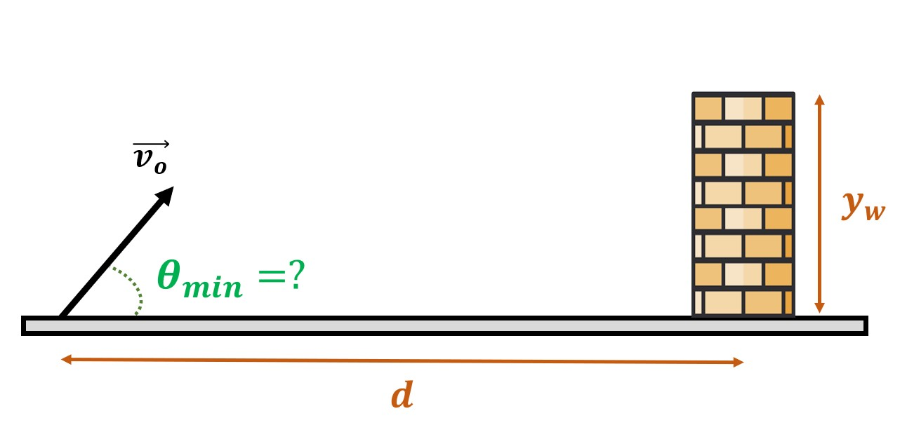

# {{ params_vars_title }}

We launch a projectile from rest at $v_0=  {{ params_v }}\ \rm{m/s}$, there is a wall ${{ params_d }}\ \rm{m}$ away. The wall is ${{ params_h }}\ \rm{m}$ tall.

## Part 1

Find the smallest angle $\theta$ in degrees possible to clear the wall.

### Answer Section

Please enter in a numeric value in {{ params_vars_units }}.

## Attribution

Problem is licensed under the [CC-BY-NC-SA 4.0 license](https://creativecommons.org/licenses/by-nc-sa/4.0/).  