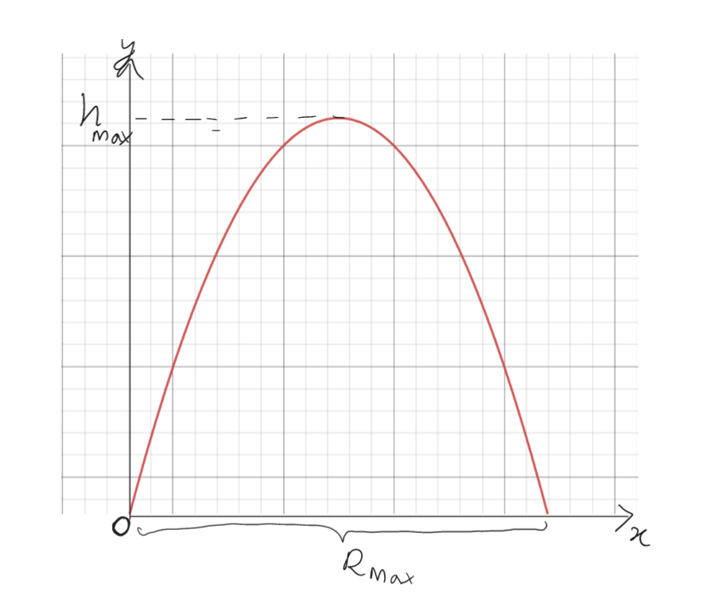
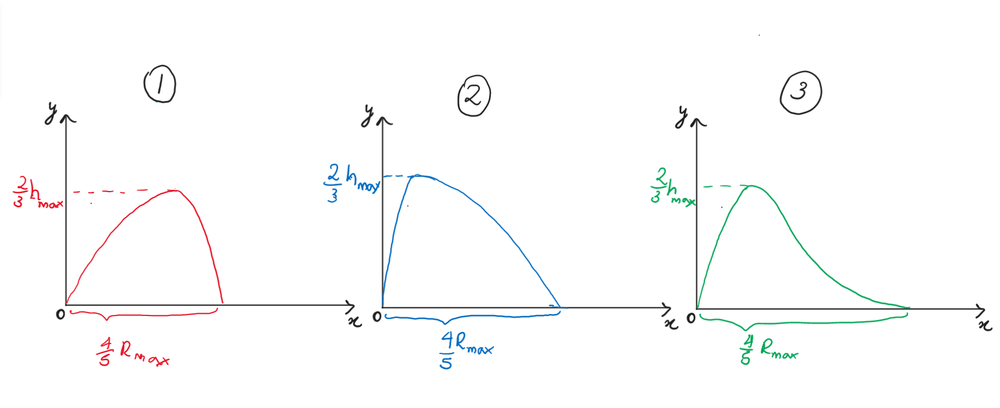

# Path of Projectile
The path traced out by a particle projected with a speed $u$ at an angle $\alpha$ measured up from the horizontal tends to resemble a parabola under the absence of air resistance as shown below.

## Part 1

If, however, a constant force of air resistance does act on the particle throughout its motion in both the vertical and horizontal directions, which of the paths below best simulate the resulting motion?

### Answer Section

- {{ params_part1_ans1_value }}
- {{ params_part1_ans2_value }}
- {{ params_part1_ans3_value }}

## Attribution

Problem is licensed under the [CC-BY-NC-SA 4.0 license](https://creativecommons.org/licenses/by-nc-sa/4.0/).  