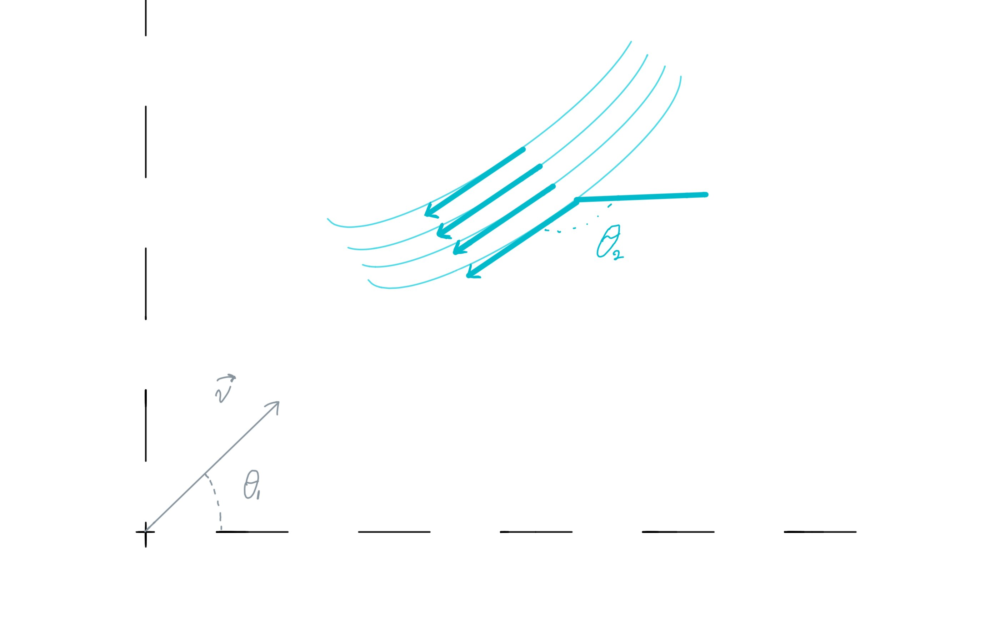

# {{ params.vars.title }}

A child wants to launch a projectile with mass $m$ at a speed of $v_0 =  {{ params.v }} \ \rm{m/s}$. There is a gust of wind blowing at an angle of $\theta_2$ = ${{ params.theta }}^\circ$ and will apply a force on their projectile at $F = {{ params.a }}.m \ \rm{N}$.

## Part 1

At what angle should the ball be thrown for it to return to their hand?

### Answer Section

Please enter in a numeric value in {{ params.vars.units }}.

## Attribution

Problem is licensed under the [CC-BY-NC-SA 4.0 license](https://creativecommons.org/licenses/by-nc-sa/4.0/).  