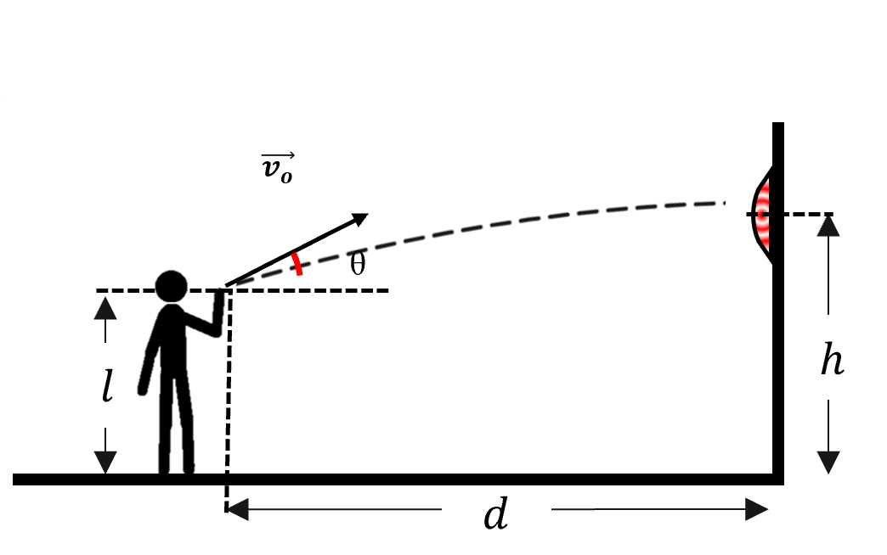

# {{ params_vars_title }}

A person is throwing a dart board that is $h = {{ params_h }} \ \rm{m}$ above the floor, and the person is $d = {{ params_d }} \ \rm{m}$ away from the dart board.
The height the dart is released at is $l = {{ params_l }} \ \rm{m}$, and the angle that the dart is thrown at is $\theta = {{ params_theta }}^{\circ}$.

## Part 1

What is the initial speed $v$ of the dart?

### Answer Section

Please enter in a numeric value in $\rm{m/s}$.

## Attribution

Problem is licensed under the [CC-BY-NC-SA 4.0 license](https://creativecommons.org/licenses/by-nc-sa/4.0/).  