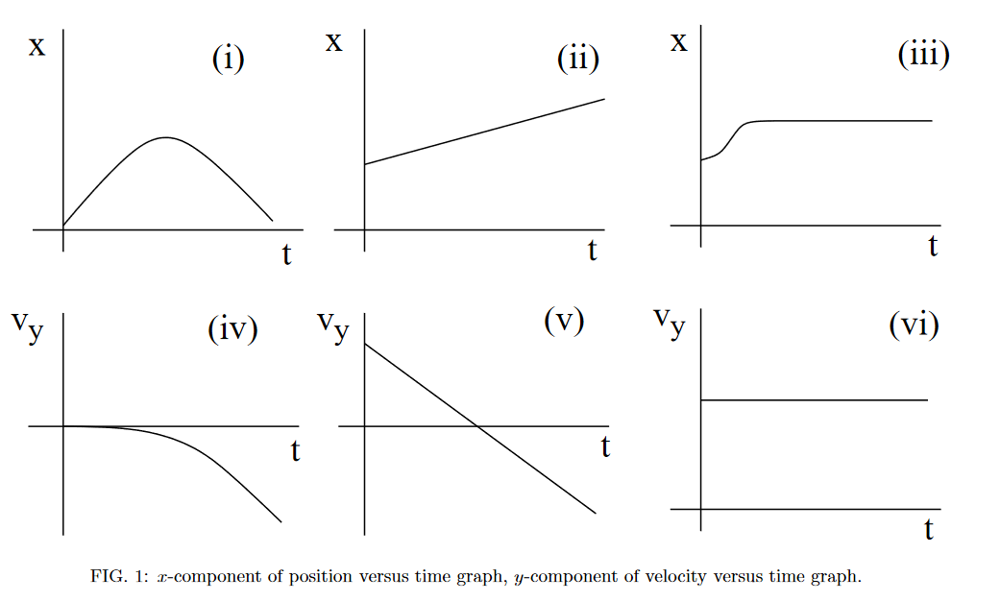

# {{ params.vars.title }}

<h5>Long Description of image: Figure of six graphs.</h5>
- Graph (i) is a displacement-time graph and it has a symmetric peak shape.  
- Graph (ii) is a displacement-time graph. It is a straight line with a positive y-intercept. 
- Graph (iii) is a displacement-time graph. It starts at a positive y-value and forms the right half of a trough (concave up and increasing) before forming a horizontal line. 
- Graph (iv) is a velocity-time graph. It starts at the origin and then forms the right half of a peak (concave down and decreasing). 
- Graph (v) is a velocity-time graph. It is a straight line with negative slope and positive y-intercept. 
- Graph (vi) is a velocity-time graph. It is a horizontal line which crosses the vertical axis at a positive value.

Long description ends.

## Part 1

Which of the above sets of graphs is consistent with projectile motion?

### Answer Section

- {{ params.part1.ans1.value }}
- {{ params.part1.ans2.value }}
- {{ params.part1.ans3.value }}
- {{ params.part1.ans4.value }}
- {{ params.part1.ans5.value }}
- {{ params.part1.ans6.value }}

## Attribution

Problem is licensed under the [CC-BY-NC-SA 4.0 license](https://creativecommons.org/licenses/by-nc-sa/4.0/).  