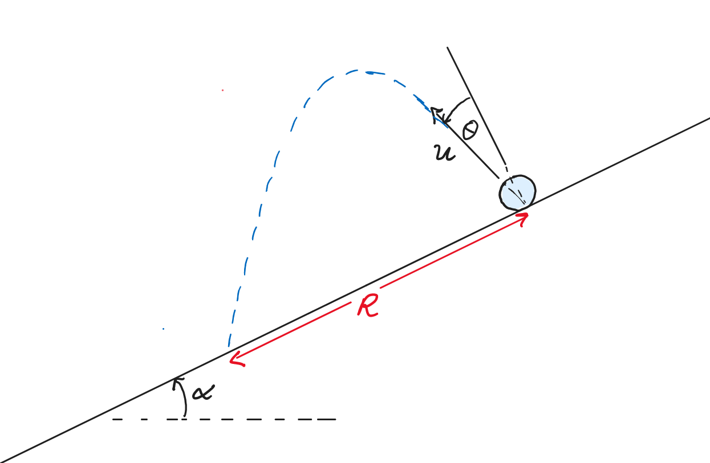

# Projectile Motion on an Incline
A tennis ball is projected with a speed of u at angle of θ measured counter-clockwise from the normal to the inclined plane.

## Part 1

Determine the range R of the tennis ball if it hits the incline at the end of its motion. 
Treat the ball as a particle and neglect any resistive forces.  
$u = {{ params_u }}ms^{-1}$, $\theta = {{ params_theta }}\circ$, $\alpha = {{ params_a }}\circ$

### Answer Section

Please enter the range in $m$.

### pl-submission-panel

{{ feedback.part1_ans }}

Everything here will get inserted directly into the pl-submission-panel element at the end of the `question.html`.
Please remove this section if it is not application for this question.

### pl-answer-panel

Everything here will get inserted directly into an pl-answer-panel element at the end of the `question.html`.
Please remove this section if it is not application for this question.

### pl-submission-panel

{{ feedback.part1_ans }}

Everything here will get inserted directly into the pl-submission-panel element at the end of the `question.html`.

### pl-answer-panel

Everything here will get inserted directly into an pl-answer-panel element at the end of the `question.html`.

## Attribution

Problem is licensed under the [CC-BY-NC-SA 4.0 license](https://creativecommons.org/licenses/by-nc-sa/4.0/).  