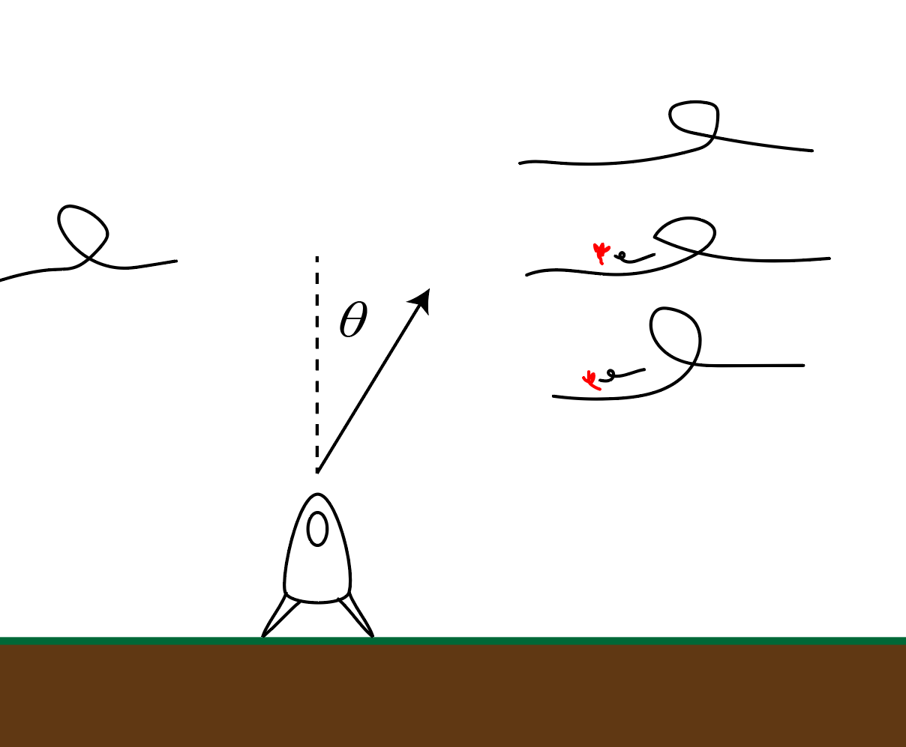

# {{ params.vars.title }}
A model rocket looks to launch with a speed $v\_{0} = {{params.v0}} m/s$.
A the windy day imparts a horizontal acceleration of ${{params.wind_speed}} m/s^2$ to the left.

## Question Text

At what angle must the rocket launch so that it returns to its liftoff point?
Assume that the wind does not affect vertical motion.

### Answer Section

Please enter in a numeric value in {{ params.vars.units }}.

## Attribution

Problem is licensed under the [CC-BY-NC-SA 4.0 license](https://creativecommons.org/licenses/by-nc-sa/4.0/).  