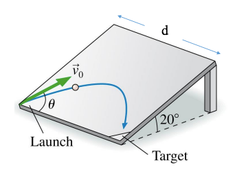

# {{ params.vars.title }}
A ball is launched with an initial velocity of $\vec{v_0}$ from one corner of a smooth, flat board.
The angle launch is $\theta$ = {{params.theta}}$^{\circ}$.
As shown, the board has a width of {{params.d}} $m$ and is tilted up at a 20.0$^{\circ}$ angle.

## Question Text

Determine the initial speed $v_0$ required to make the ball land at the adjacent corner labelled as "Target".

### Answer Section

Please enter in a numeric value in {{ params.vars.units }}.

## Attribution

Problem is licensed under the [CC-BY-NC-SA 4.0 license](https://creativecommons.org/licenses/by-nc-sa/4.0/).  