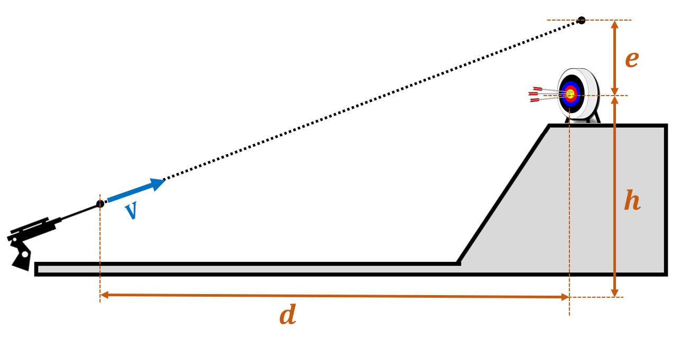

# {{ params_vars_title }}
A sniper is practicing their shots on a target $h = {{ params_h }} \ \rm{m}$ high at $d = {{ params_d }} \ \rm{km}$ away.

## Question Text

If the bullet leaves the gun at $v = {{params_v}} \ \rm{m/s}$, at what elevation $e$ above the target should the sniper aim?

### Answer Section

Please enter in a numeric value in $m$.

## Attribution

Problem is licensed under the [CC-BY-NC-SA 4.0 license](https://creativecommons.org/licenses/by-nc-sa/4.0/).  