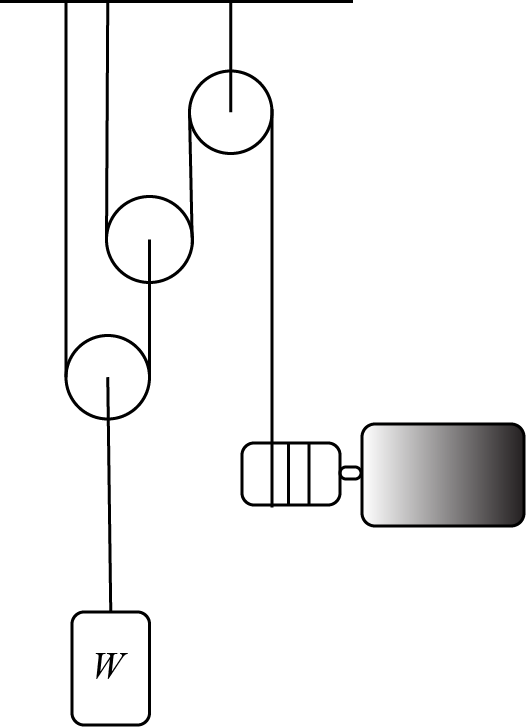

# {{ params.vars.title }}

## Question Text

How far does the weight $W$ rise in {{params.t}} seconds if the motor wraps the cable at a constant rate of ${{params.v_a}} mm/s$?

### Answer Section

Please enter an integer value in ${{ params.vars.units }}$.

## Attribution

Problem is licensed under the [CC-BY-NC-SA 4.0 license](https://creativecommons.org/licenses/by-nc-sa/4.0/).  