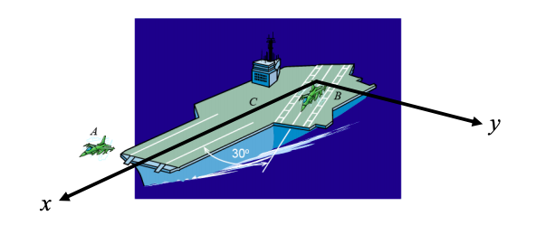

# {{ params.vars.title }}
Plane A takes off with a velocity of $\vec{v_A}$ = ({{ params.va }} $km/h$)$\hat{\imath}$ relative to the aircraft carrier. On a second runway which is directed 30$^{\circ}$ away from the $x$-axis, plane B has a speed of {{ params.vb }} $km/h$ relative to the aircraft carrier.

| For  | Use   |
|----------|-------|
| $\hat{i}$  | i_hat  |
| $\hat{j}$  | j_hat  |

## Part 1

What are the x- and y-components of the velocity of plane A as measured by the pilot of plane B?

Your answer should be of the form `100*i_hat -50*j_hat` since it's a symbolic question, it won't resolve the math for you so round the x and y components to the nearest integer.

### Answer Section

## Attribution

Problem is licensed under the [CC-BY-NC-SA 4.0 license](https://creativecommons.org/licenses/by-nc-sa/4.0/).  