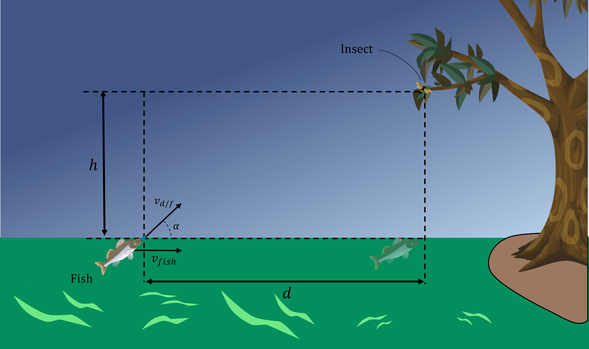

# {{ params_vars_title }}
An archer fish catches insect prey by squirting water droplets into the air to knock insects off the leaves above the surface of the water.  

This archer fish is moving with a constant speed of ${{params_vf}} \ \rm{m/s}$ horizontally toward the insect. At a moment in time such that $d= {{params_d}}\ \rm{m}$, the archer fish ejects a water droplet at an angle $\alpha$ such that it will hit the insect and the insect will fall vertically down from the tree with $h = {{params_h}}\ \rm{m}$.   At the moment the insect hits the water, the archer fish arrives to point $\rm{A}$ and catches the insect at the same time.

## Question Text

What is the angle $\alpha$ with which the fish has to eject the droplet from the archer fish's line of sight so that the fish can catch the insect at the same time it hits the water?
 
Treat the droplet, fish, and insect as particles. Neglect air resistance and recoil of fish after ejecting the droplet.

### Answer Section

Please enter in a numeric value in degrees.

## Attribution

Problem is licensed under the [CC-BY-NC-SA 4.0 license](https://creativecommons.org/licenses/by-nc-sa/4.0/).  