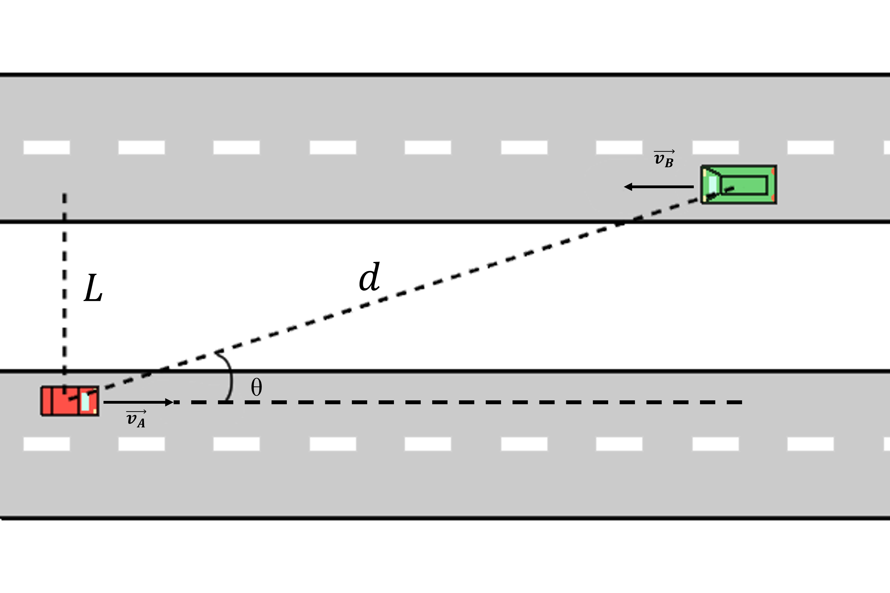

# {{ params_vars_title }}
Two cars are driving at constant speeds on two parallel opposing lanes of a divided highway.
The lanes are $L = {{params_l}} \ \rm{m}$ apart and the cars are $d = {{params_d}} \ \rm{m}$ away from each other.
Car $A$ is traveling at ${{params_va}} \ \rm{km/h}$ and car $B$ at ${{params_vb}} \ \rm{km/h}$.

## Part 1

If $\theta$ is the angle between the road and a line connecting the cars, what is $\dot \theta$?

### Answer Section

Please enter in a numeric value in $\rm{^\circ/s}$.

## Part 2

What is $\ddot \theta$?

### Answer Section

Please enter in a numeric value in $\rm{^\circ/s^2}$.

## Attribution

Problem is licensed under the [CC-BY-NC-SA 4.0 license](https://creativecommons.org/licenses/by-nc-sa/4.0/).  