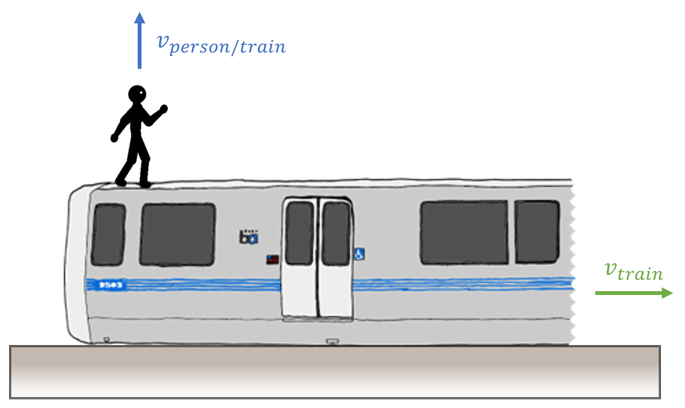

# Jumping from train
A person is standing at the edge of a moving train as illustrated below.

## Part 1

If the person jumps vertically with a speed $v$ relative to the train, where does the person land? 
Neglect any resistive forces acting on the person.

### Answer Section

- {{ params.part1.ans1.value }}
- {{ params.part1.ans2.value }}

## Attribution

Problem is licensed under the [CC-BY-NC-SA 4.0 license](https://creativecommons.org/licenses/by-nc-sa/4.0/).  