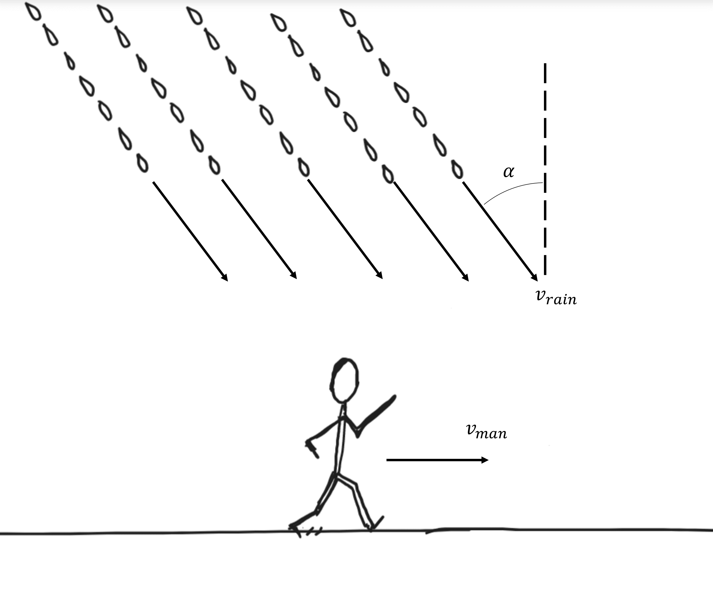

# Person Running in Rain
A man without an umbrella is running along a straight road with constant speed whilst it is raining.

## Part 1

If the rain droplets are falling with a terminal velocity of $v\_{rain} = {{ params.v_r1 }}\ \rm{mph}$ at an angle of $\alpha = {{ params_a }}^{\circ}$ from the vertical, what must the speed of the person be such that the rain does not hit his face or clothes?
 
Treat the man and rain droplets as particles. Assume the man's face is always oriented parallel to the horizontal.

### Answer Section

Please enter the speed in $\rm{mph}$.

## Part 2

What is the speed of the rain droplets relative to the man?

### Answer Section

Please enter the speed in $mph$.

## Attribution

Problem is licensed under the [CC-BY-NC-SA 4.0 license](https://creativecommons.org/licenses/by-nc-sa/4.0/).  