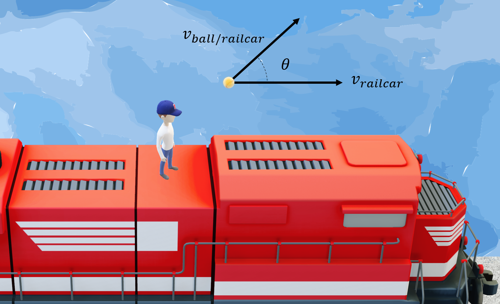
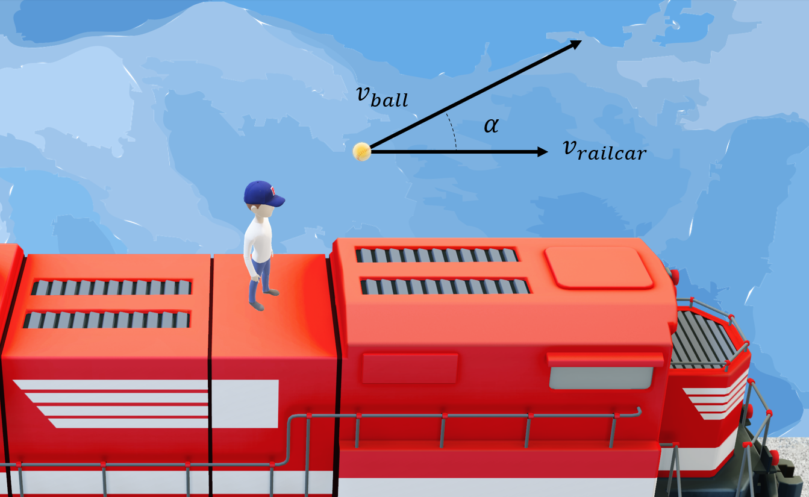

# Railcar Softball Pitch
A softball pitcher stands atop a moving railcar which is moving in a straight line with a speed of $v\_{railcar} = {{ params.v_r }}\ \rm{m/s}$ as illustrated in the figure below.

## Part 1

If the pitcher throws a ball horizontally at a speed of $v\_{ball/railcar} = {{ params.v_b_r }}\ \rm{m/s}$ relative to the railcar at an angle $\theta = {{ params_theta }}\ \rm{^{\circ}}$ measured counterclockwise from the direction of motion of the car, what is the speed($v\_{ball}$) of the ball relative to the ground at the instant of projection?
 

### Answer Section

Please enter the value of $v\_{ball}$ in $\rm{m/s}$.

## Part 2

What is the angle $\alpha$, measured counter-clockwise, that the velocity of the ball relative to the ground makes with the direction of motion of the railcar?

### Answer Section

Please enter the value of $\alpha$ in $\rm{^{\circ}}$.

## Attribution

Problem is licensed under the [CC-BY-NC-SA 4.0 license](https://creativecommons.org/licenses/by-nc-sa/4.0/).  