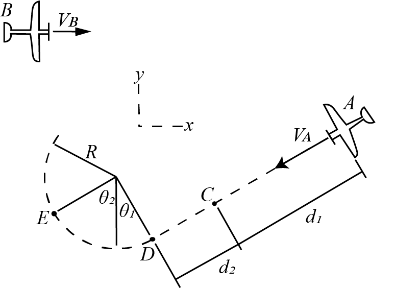

# {{ params.vars.title }}

Plane A enters a trick shown in the path above, at a constant speed of ${{params.v_A}}km/h$.
Relative to the pilot in plane B, who flies in a straight line at a constant speed of ${{params.v_B}}km/h$.
Both planes are in a horizontal plane.
$\theta\_{1} = {{params.theta1}}$, $\theta\_{2} = {{params.theta2}}$, $d\_{1} = {{params.d1}}$, $d\_{2} = {{params.d2}}$

## Part 1

What is the X-component of the velocity which plane A appears to have at C?

### Answer Section

Please enter in a numeric value in $km/h$.

## Part 1

What is the Y-component of the velocity which plane A appears to have at C?

### Answer Section

Please enter in a numeric value in $km/h$.

## Part 3

What is the X-component of the velocity which plane A appears to have at E?

### Answer Section

Please enter in a numeric value in $km/h$.

## Part 4

What is the Y-component of the velocity which plane A appears to have at E?

### Answer Section

Please enter in a numeric value in $km/h$.

## Attribution

Problem is licensed under the [CC-BY-NC-SA 4.0 license](https://creativecommons.org/licenses/by-nc-sa/4.0/).  