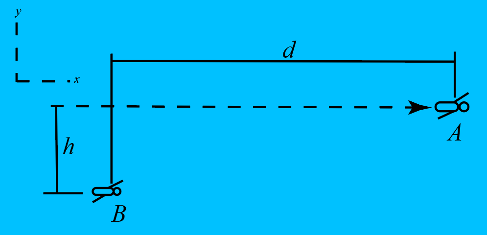

# {{ params.vars.title }}

In a game of sharks and minos, two swimmers move as shown.
Swimmer B needs to catch A within {{params.t}} seconds from when shown, and A has a velocity of ${{params.v}} ft/s$.
Assume $h = {{params.h}} ft$ and $d = {{params.d}} ft$.

## Part 1

What velocity should swimmer B maintain?

### Answer Section

## Part 2

What is the angle of the velocity vector of swimmer B?

### Answer Section

## Attribution

Problem is licensed under the [CC-BY-NC-SA 4.0 license](https://creativecommons.org/licenses/by-nc-sa/4.0/).  