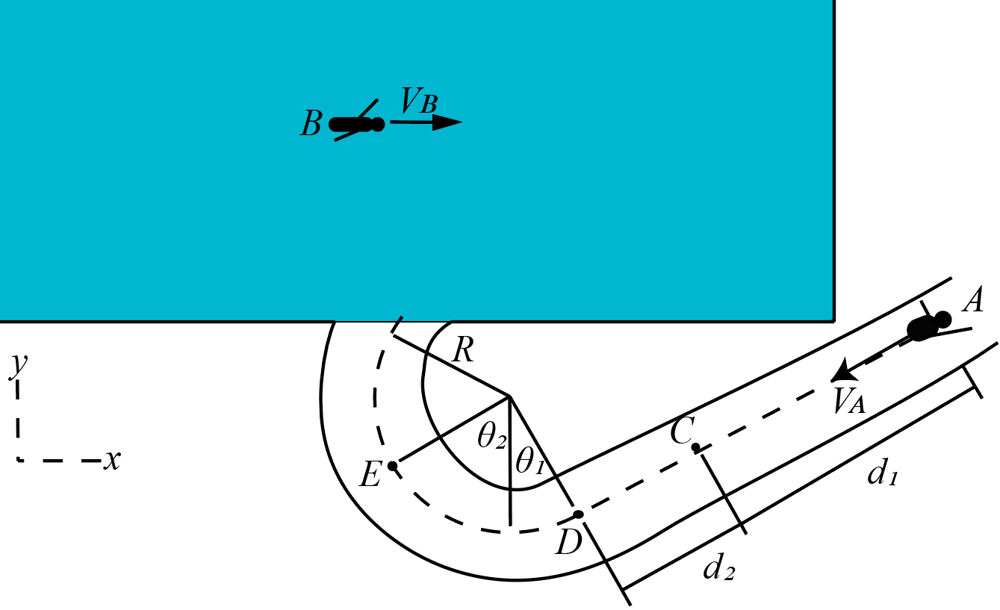

# {{ params_vars_title }}

A child, A, floats down the lazy river, at a constant speed of ${{params.v_AB}} m/s$ relative to the swimmer B, who is swimming in a straight line at a constant speed of ${{params.v_B}} m/s$ relative to a stationary observer on the pool deck.
Both swimmers are viewed in the horizontal plane.
In the above figure, $\theta\_{1} = {{params_theta1}}$, $\theta\_{2} = {{params_theta2}}$, $d\_{1} = {{params_d1}}$, and $d\_{2} = {{params_d2}}$.
Note that the line between $\theta\_{1}$ and $\theta\_{2}$ is parallel to the y-axis.

## Part 1

What is the x-component of the velocity that child A appears to have at C relative to the observer on the pool deck?

### Answer Section

Please enter in a numeric value in $m/s$.

## Part 2

What is the y-component of the velocity which child A appears to have at C relative to the observer on the pool deck?

### Answer Section

Please enter in a numeric value in $m/s$.

## Part 3

What is the x-component of the velocity which child A appears to have at E relative to the observer on the pool deck?

### Answer Section

Please enter in a numeric value in $m/s$.

## Part 4

What is the y-component of the velocity which child A appears to have at E relative to the observer on the pool deck?

### Answer Section

Please enter in a numeric value in $m/s$.

## Attribution

Problem is licensed under the [CC-BY-NC-SA 4.0 license](https://creativecommons.org/licenses/by-nc-sa/4.0/).  