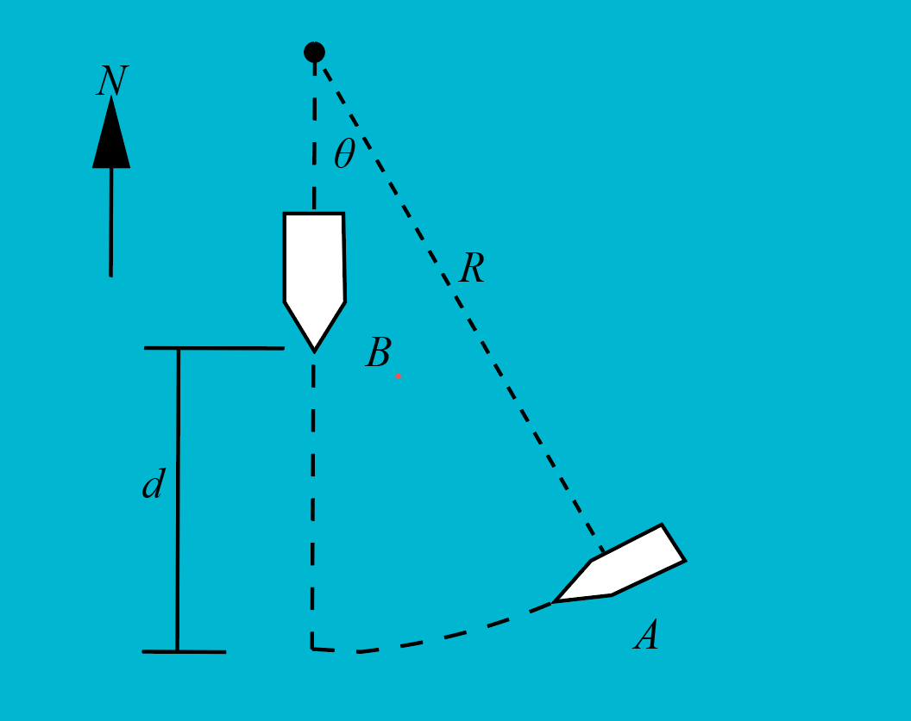

# {{ params.vars.title }}

Car A rounds a curve, $r = {{params.r}}m$, at a constant speed of {{params.v}}km/hr.
When A is as shown, B is $d = {{params.d}} m$ from the intersection, and is accelerating at a rate of ${{params.a}} m/s^2$.
Assume $\theta = {{params.theta}}^{\circ}$.

## Part 1

What is the acceleration of B as seen by the driver in car A?

### Answer Section

## Part 2

What is the angle of the acceleration vector?

### Answer Section

## Attribution

Problem is licensed under the [CC-BY-NC-SA 4.0 license](https://creativecommons.org/licenses/by-nc-sa/4.0/).  