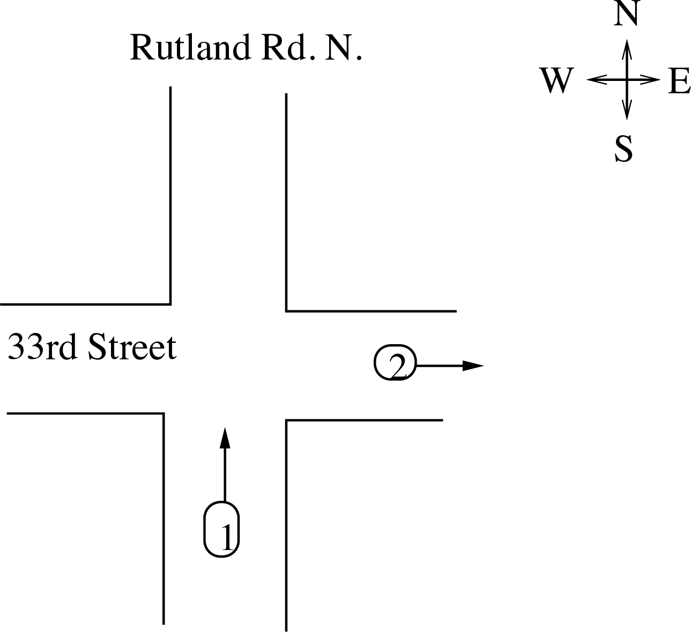

# {{ params.vars.title }}
A {{ params.vars.vehicle }} drives northward on Rutland Road North at {{ params.v }} {{ params.vars.units }} towards the intersection with 33rd Street.
A second {{ params.vars.vehicle }} drives eastward at {{params.v}} {{ params.vars.units }} on 33rd Street having just left the same intersection as shown in the figure below.

As a passenger in the second {{ params.vars.vehicle }}, the first {{ params.vars.vehicle }} appears to travel at a velocity $v$.

## Part 1

What is the magnitude of $v$, in {{ params.vars.units }}?

### Answer Section

Please enter in a numeric value in {{ params.vars.units }}.

## Part 2

What is the (cardinal) direction of $v$ ?

### Answer Section

- {{ params.part2.ans1.value }}
- {{ params.part2.ans2.value }}
- {{ params.part2.ans3.value }}
- {{ params.part2.ans4.value }}
- {{ params.part2.ans5.value }}
- {{ params.part2.ans6.value }}
- {{ params.part2.ans7.value }}
- {{ params.part2.ans8.value }}
- {{ params.part2.ans9.value }}

## Attribution

Problem is licensed under the [CC-BY-NC-SA 4.0 license](https://creativecommons.org/licenses/by-nc-sa/4.0/).  