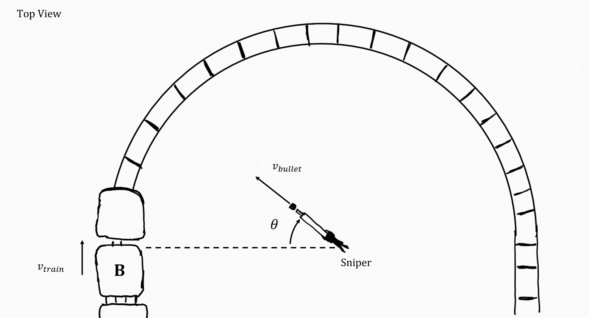
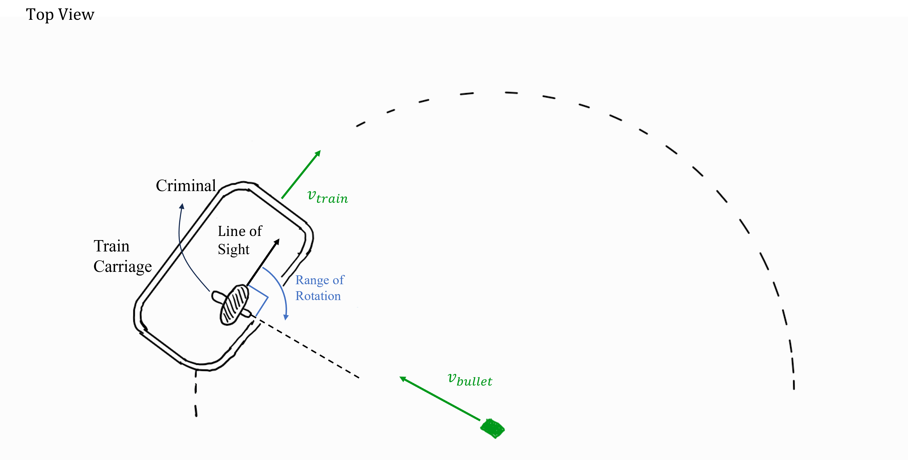
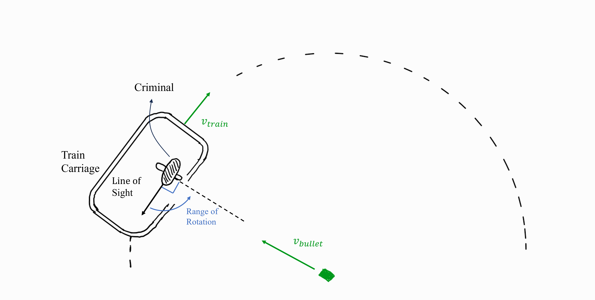

# Sniper and Moving Target
A sniper has been ordered a hit on a dangerous criminal. It has been determined that the fugitive is being transported on a train and is seated in carriage B. The sniper plans to shoot during the time the train spends on the curve.

## Part 1

If the train moves with a constant speed of $v\_{train} = {{ params.v_t }}\ \rm{ms^{-1}}$ on the curve what is the angle $\theta$ measured relative to the horizontal that the sniper has to aim to hit the criminal?
 
Assume the bullet and train are on the same plane and neglect any resistive forces.
 
$v\_{bullet} = {{ params.v_b }}\ \rm{ms^{-1}}$, $R = {{ params_r }}\ \rm{m}$

### Answer Section

Please enter in the angle in degrees.

## Part 2

The sniper is not informed of the exact position and seating arrangement of the criminal in carriage B. If the position and line of sight of the criminal is as in the figure below, can the criminal see the trajectory of the bullet, allowing him to escape?

Assume the criminal can only rotate his head a maximum of **$90^{\circ}$ clockwise** from his **line of sight**. Also assume his line of sight is **collinear** with the velocity of the train.
 Assume the criminal has "laser vision acute vision in his line of sight".
 
Use the angle calculated in the previous part of this question for $\theta$.
  
<i>Hint: Start by calculating the relative velocity of the bullet to the criminal.</i>

### Answer Section

- {{ params_part2_ans1_value}}
- {{ params_part2_ans2_value}}

## Part 3

If the criminal is, however, in the opposite seat, can the sniper shoot at any point along the curve without the criminal being able to see the trajectory of the bullet?

Assume the criminal can only rotate his head a maximum of **$90^{\circ}$ anti-clockwise** from his **line of sight**. Also assume his line of sight is **collinear** with the velocity of the train.

### Answer Section

- {{ params_part3_ans1_value}}
- {{ params_part3_ans2_value}}

## Attribution

Problem is licensed under the [CC-BY-NC-SA 4.0 license](https://creativecommons.org/licenses/by-nc-sa/4.0/).  