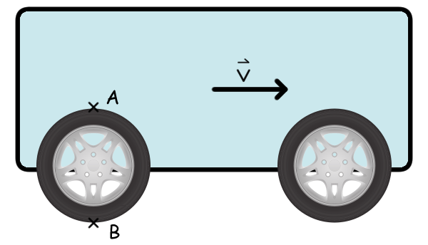

# {{ params_vars_title }}
A cart on wheels is moving to the right with a velocity of $\vec{v}$ without slipping or skidding.
Point $A$ is situated at the top of a wheel, and point $B$ is at the bottom of a wheel.

## Part 1

What is the velocity of point $A$ relative to the ground?

### Answer Section

- {{ params_part1_ans1_value }}
- {{ params_part1_ans2_value }}
- {{ params_part1_ans3_value }}
- {{ params_part1_ans4_value }}
- {{ params_part1_ans5_value }}

## Part 2

What is the velocity of point $B$ relative to the ground?

### Answer Section

- {{ params_part2_ans1_value }}
- {{ params_part2_ans2_value }}
- {{ params_part2_ans3_value }}
- {{ params_part2_ans4_value }}
- {{ params_part2_ans5_value }}

## Attribution

Problem is licensed under the [CC-BY-NC-SA 4.0 license](https://creativecommons.org/licenses/by-nc-sa/4.0/).  