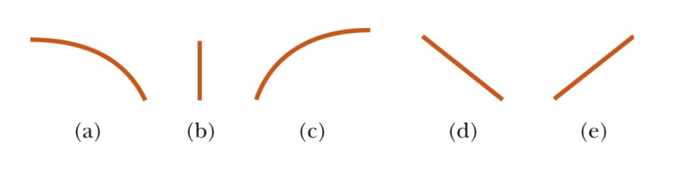

# {{ params.vars.title }}
An apple tree is transported by a truck moving to the right with constant velocity.
One of the apples shakes loose and falls towards the bed of the truck.

## Part 1

Of the curves shown above, which best describes the path followed by the apple as seen by a stationary observer on the ground, who observes the truck moving from their left to their right?

### Answer Section

- {{params.part1.ans1.value}}
- {{params.part1.ans2.value}}
- {{params.part1.ans3.value}}
- {{params.part1.ans4.value}}
- {{params.part1.ans5.value}}

## Part 2

Of the curves shown above, which best describes the path followed by the apple as seen by an observer sitting in the truck?

### Answer Section

- {{params.part2.ans1.value}}
- {{params.part2.ans2.value}}
- {{params.part2.ans3.value}}
- {{params.part2.ans4.value}}
- {{params.part2.ans5.value}}

## Attribution

Problem is licensed under the [CC-BY-NC-SA 4.0 license](https://creativecommons.org/licenses/by-nc-sa/4.0/).  