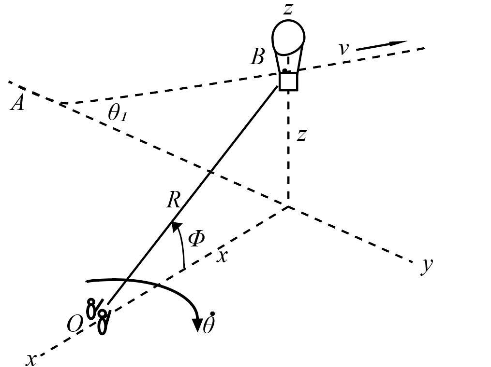

# {{ params_vars_title }}

A hot air balloon takes off at $A$ and climbs at a steady angle, $\theta\_{1} = {{params_angle}}^{\circ}$ in the y-z plane at a speed of {{params_v}} $km/h$. The hot air balloon is watched by two observers $O$.
Calculate the following values as the balloon passes point $B$, $x =$ {{params_x}} $m$ and $z =$ {{params_z}} $m$.

## Part 1

Calculate $\dot{R}$.

### Answer Section

## Part 2

Calculate $\dot{\theta}$.

### Answer Section

## Part 3

Calculate $\dot{\phi}$.

### Answer Section

## Attribution

Problem is licensed under the [CC-BY-NC-SA 4.0 license](https://creativecommons.org/licenses/by-nc-sa/4.0/).  