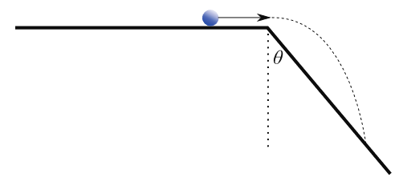

# {{ params.vars.title }}
A small ball is launched from a horizontal cliff with initial speed {{ params.v0 }} $m/s$. The side of the cliff is sloped. The ball makes contact with the cliff side after falling a vertical distance of {{ params.h }} cm.

## Part 1

How long was the ball in the air before hitting the side of the cliff?

### Answer Section

Please enter in a numeric value in {{ params.vars.unit1 }}.

## Part 2

What is the value of the angle $\theta$ shown in the figure?

### Answer Section

Please enter in a numeric value in {{ params.vars.unit2 }}.

## Part 3

What is the velocity of the ball just before hitting the side of the cliff? Give your final answer in terms of the $x$- and $y$-components of the velocity and the unit vectors $\hat{\imath}$ and $\hat{\jmath}$.

Please enter the coefficient of $\hat{\imath}$ (in $m/s$).

### Answer Section

Please enter in a numeric value in {{ params.vars.unit3 }}.

## Part 4

What is the velocity of the ball just before hitting the side of the cliff? Give your final answer in terms of the $x$- and $y$-components of the velocity and the unit vectors $\hat{\imath}$ and $\hat{\jmath}$.

Please enter the coefficient of $\hat{\jmath}$ (in $m/s$).

### Answer Section

Please enter in a numeric value in {{ params.vars.unit3 }}.

## Attribution

Problem is licensed under the [CC-BY-NC-SA 4.0 license](https://creativecommons.org/licenses/by-nc-sa/4.0/).  