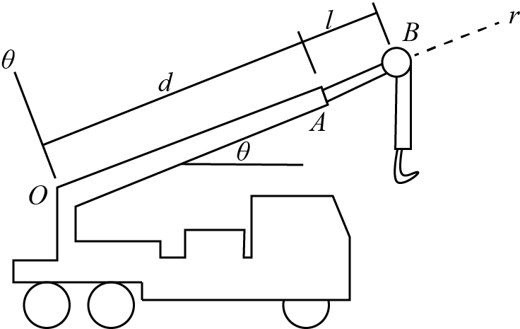

# {{ params.vars.title }}

The arm $OAB$ moves about point $O$, while section $AB$ extends out from $OA$.

For the following conditions:
$d = {{params.d}} ft$, $\theta = {{params.theta}}^{\circ}$, $\dot{\theta} = {{params.dot_theta}} deg/s$, $\ddot{\theta} = {{params.ddot_theta}} deg/s^2$, $l = {{params.l}} ft$, $\dot{l} = {{params.dot_l}} ft/s$, $\ddot{l} = {{params.ddot_l}} ft/s^2$

$\ddot{l}$ and $\ddot{l}$ are the first and second-time derivatives of the extending section AB.

## Part 1

Determine the $e\_{r}$ component of the velocity of the pulley at $B$.

### Answer Section

## Part 2

Determine the $e\_{\theta} ft/s$ component of the velocity of the pulley at $B$.

### Answer Section

## Part 3

Determine the $e\_{r}$ component of the acceleration of the pulley at $B$.

### Answer Section

## Part 4

Determine the $e\_{\theta} ft/s$ component of the acceleration of the pulley at $B$.

### Answer Section

## Attribution

Problem is licensed under the [CC-BY-NC-SA 4.0 license](https://creativecommons.org/licenses/by-nc-sa/4.0/).  