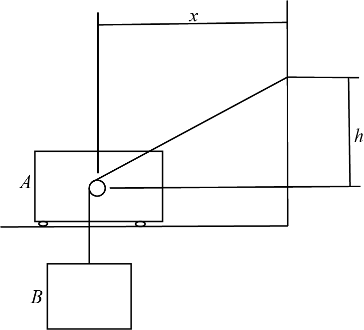

# {{ params_vars_title }}

## Question Text

Determine the magnitude of the total velocity of $B$ as cart $A$ moves to the right with $v = {{params.v_a}}m/s$.
Assume the cable for $B$ remains vertical, and the diameter of the pully is negligible.
Assume $x = {{params_x}}m$, and $h = {{params_h}}m$.

### Answer Section

Please enter an integer value in ${{ params_vars_units }}$.

## Attribution

Problem is licensed under the [CC-BY-NC-SA 4.0 license](https://creativecommons.org/licenses/by-nc-sa/4.0/).  