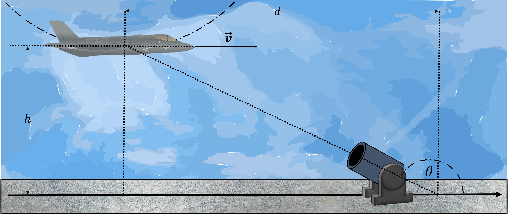

# {{ params_vars_title }}

A jet flies in loops as part of a military parade.
In the moment shown, it is at an altitude of $h = {{ params_h }} \ \rm{m}$ at the bottom of its loop.
The camera on the ground, sitting $d = {{ params_d }} \ \rm{m}$ away from the jet.
The fighter jet has a horizontal velocity of $v = {{ params_v }} \ \rm{km/h}$.
The radius of the curvature of the jets circular path is $\rho = {{ params_rho }} \ \rm{m}$.

Find the values of $\dot r$ and $\dot \theta$

## Part 1

### Answer Section

Please enter in a numeric value in $m/s$.

## Part 2

### Answer Section

Please enter in a numeric value in $rad/s$.

## Attribution

Problem is licensed under the [CC-BY-NC-SA 4.0 license](https://creativecommons.org/licenses/by-nc-sa/4.0/).  