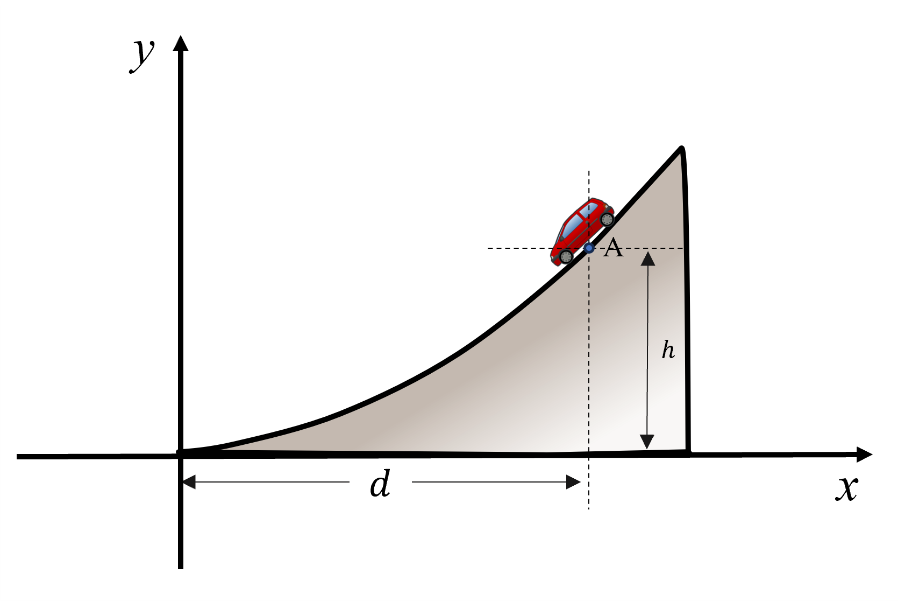

# {{ params_vars_title }}

A car travels down a hill which has a parabola of $y = {{ params_m }}x^2$.
At point A, the speed is $v = {{ params_v }} \ \rm{m/s}$ and it is increasing at the rate of $\dot v = {{ params_vdot }} \ \rm{m/s^2}$.
The height relative to the ground to point A is $h = {{ params_h }} \ \rm{m}$ and the distance from the origin to point A is $d = {{ params_d }} \ \rm{m}$.
What is the magnitude of acceleration at point A?

## Part 1

Determine the radius of curveture of the hill at point A.

### Answer Section

Please enter in a numeric value in $\rm{m}$.

## Part 2

Determine the magnitude of acceleration of the car.

### Answer Section

Please enter in a numeric value in $\rm{m/s^2}$.

## Attribution

Problem is licensed under the [CC-BY-NC-SA 4.0 license](https://creativecommons.org/licenses/by-nc-sa/4.0/).  