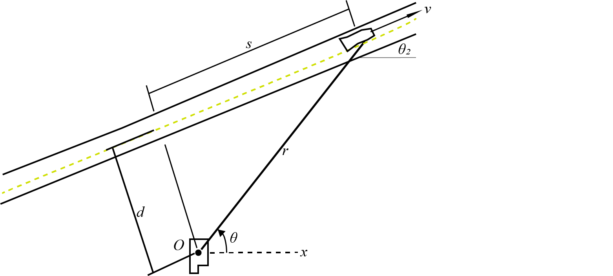

# {{ params_vars_title }}

A police radar located at O serves automated tickets to speeding highway drivers. It is located $d = {{params_d}}ft$ from the highway.
As a car cruises by, $\theta\_{1} = {{params_angle1}}^{\circ}$ and the radius from the radar is increasing at $\dot r = {{params.r_dot}}ft/sec$.
The angle $\theta\_{2} = {{params_angle2}}^{\circ}$

## Part 1

Determine the corresponding speed $v$ of the car.

### Answer Section

Please enter in a numeric value in $ft/s$.

## Part 2

Determine the value of $\dot \theta$.

### Answer Section

Please enter in a numeric value in $rad/s$.

## Attribution

Problem is licensed under the [CC-BY-NC-SA 4.0 license](https://creativecommons.org/licenses/by-nc-sa/4.0/).  