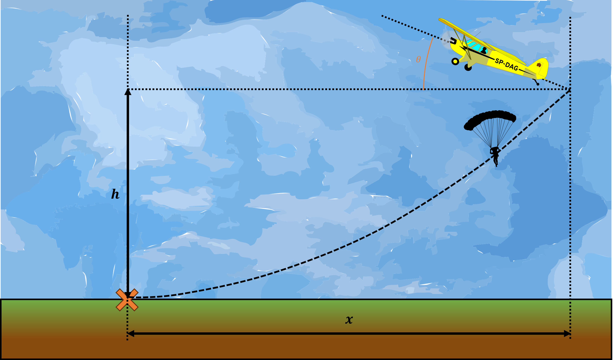

# {{ params.vars.title }}

A parachuter jumps out of a plane at height $h = {{ params.h }} \ \rm{m}$, with a goal of landing at a marked spot to meet a group of people.  The plane has a velocity $v = {{ params.v }} \ \rm{km/hr}$ with angle $\theta = {{ params.theta }}^{\circ}$

## Part 1

At what time will the parachuter land in the marked spot?

### Answer Section

Please enter in a numeric value in {{ params.vars.units }}.

## Part 2

What is the distance the parachuter traveled?

### Answer Section

Please enter in a numeric value in {{ params.vars.units }}.

## Attribution

Problem is licensed under the [CC-BY-NC-SA 4.0 license](https://creativecommons.org/licenses/by-nc-sa/4.0/).  