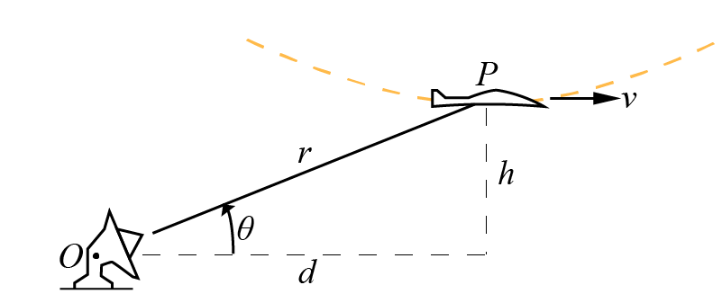

# {{ params.vars.title }}

As an airplane reaches the bottom of a loop in the vertical plane, it has a horizontal velocity of $v = {{params.v}}km/hr$ and no horizontal acceleration.
The radius of curvature for the loop is m, and the altitude of the plane is ${{params.h}}m$.
For the radar tracking at $O$, $d = {{params.d}}m$ away.

## Part 1

Determine the value of $\ddot{r}$.

### Answer Section

## Part 2

Determine the value of $\ddot{\theta}$.

### Answer Section

## Attribution

Problem is licensed under the [CC-BY-NC-SA 4.0 license](https://creativecommons.org/licenses/by-nc-sa/4.0/).  