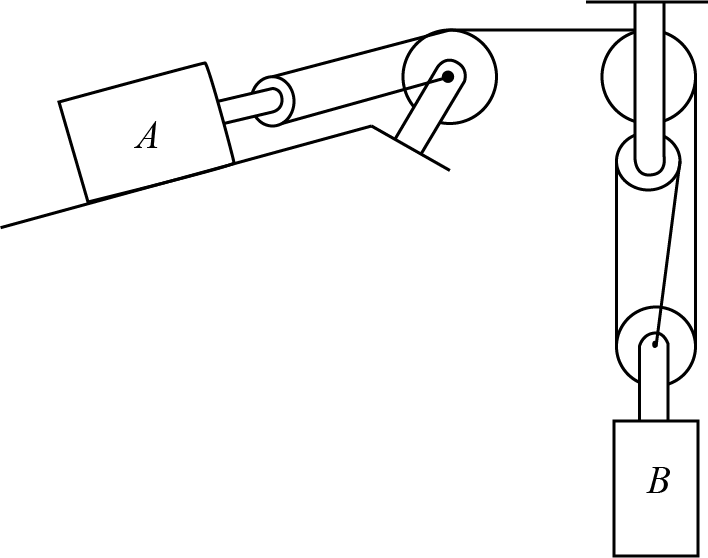

# {{ params.vars.title }}

In the moment shown above, $B$ is travelling downwards at $v = {{params.v_b}}m/s$, but accelerating upwards at $a = {{params.a_b}}m/s^2$.

## Part 1

Determine the velocity of block $A$. Positive if downhill, negative if uphill.

### Answer Section

Please enter an integer value in ${{ params.vars.units_v }}$.

## Part 2

Determine the acceleration of block $A$. Positive if downhill, negative if uphill.

### Answer Section

Please enter an integer value in ${{ params.vars.units_a }}$.

## Attribution

Problem is licensed under the [CC-BY-NC-SA 4.0 license](https://creativecommons.org/licenses/by-nc-sa/4.0/).  