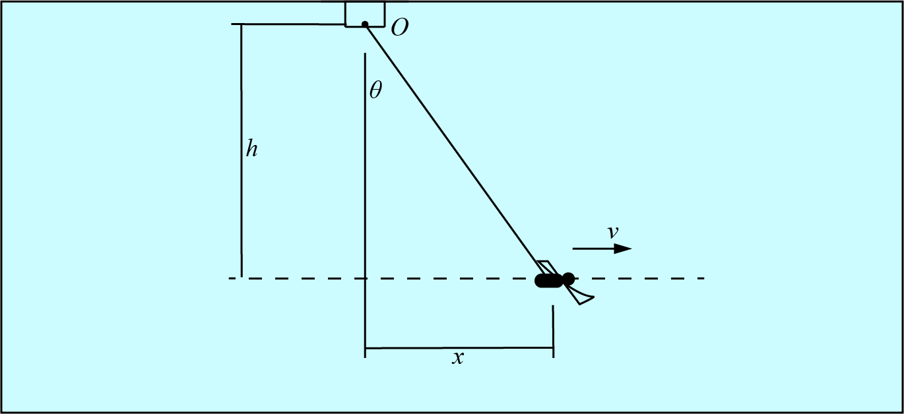

# {{ params_vars_title }}

A lifeguard watches a swimmer train while sitting at their chair, fixed at point O.
They swim at $v = {{params_v}}$ m/s, while they slow them at a rate of ${{params_a}}$ m/s^2$ in the moment shown.
Determine the following values where $r$ is the length between the lifeguard and swimmer, $h = {{params_h}}$ m and $x = {{params_x}}$ m.

## Part 1

Determine the value of $\ddot{r}$

### Answer Section

## Part 2

Determine the value of $\ddot{\theta}$

### Answer Section

## Attribution

Problem is licensed under the [CC-BY-NC-SA 4.0 license](https://creativecommons.org/licenses/by-nc-sa/4.0/).  