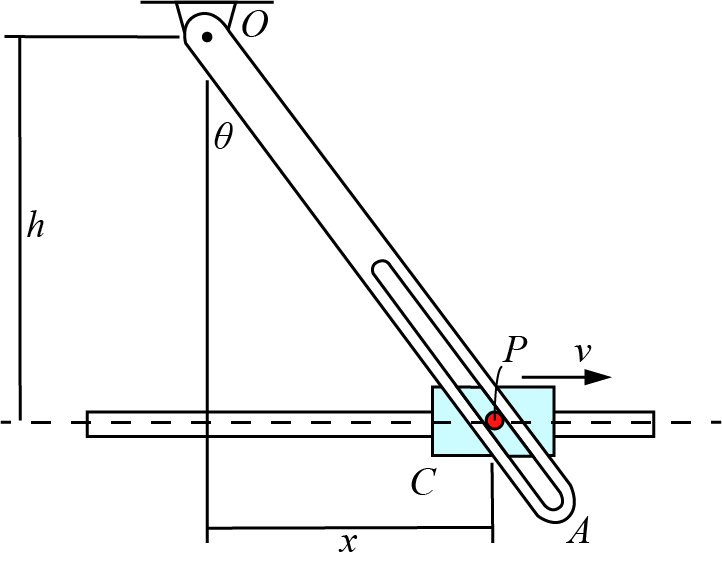

# {{ params.vars.title }}

The bar $OA$ is rotated by a collar $C$ which moves a pin $P$ with velocity of $v = {{params.v}} mm/s$.
The velocity of the collar $C$ is decreasing at a rate of ${{params.a}} mm/s^2$ in the moment shown.
Determine the following values where $r = \bar{OP}$, $h = {{params.h}} mm$ and $x = {{params.x}} mm$.

## Part 1

Determine the value of $\ddot{r}$

### Answer Section

## Part 2

Determine the value of $\ddot{\theta}$

### Answer Section

## Attribution

Problem is licensed under the [CC-BY-NC-SA 4.0 license](https://creativecommons.org/licenses/by-nc-sa/4.0/).  