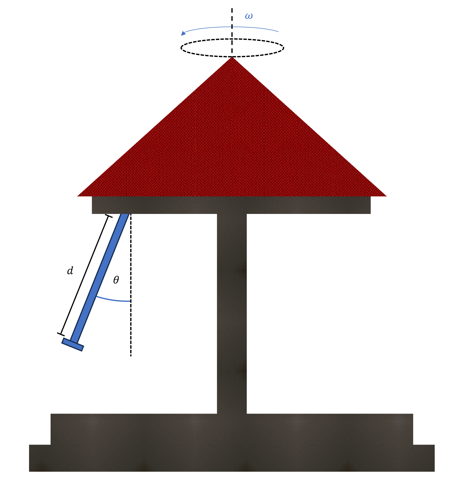

# {{ params.vars.title }}

A person is on a swing ride, rotating at a $\omega = {{ params.omega}}\ \rm{rad/s}$. The combined mass of the person and the seat is $m = {{ params.m }}\ \rm{kg}$. The length of the cable connecting the seat to the ride is $ d =$ ${{ params.d}}\ \rm{m}$.

## Part 1

What is the angle $\theta$ in degrees?

### Answer Section

Please enter in a numeric value in {{ params.vars.units }}.

## Attribution

Problem is licensed under the [CC-BY-NC-SA 4.0 license](https://creativecommons.org/licenses/by-nc-sa/4.0/).  