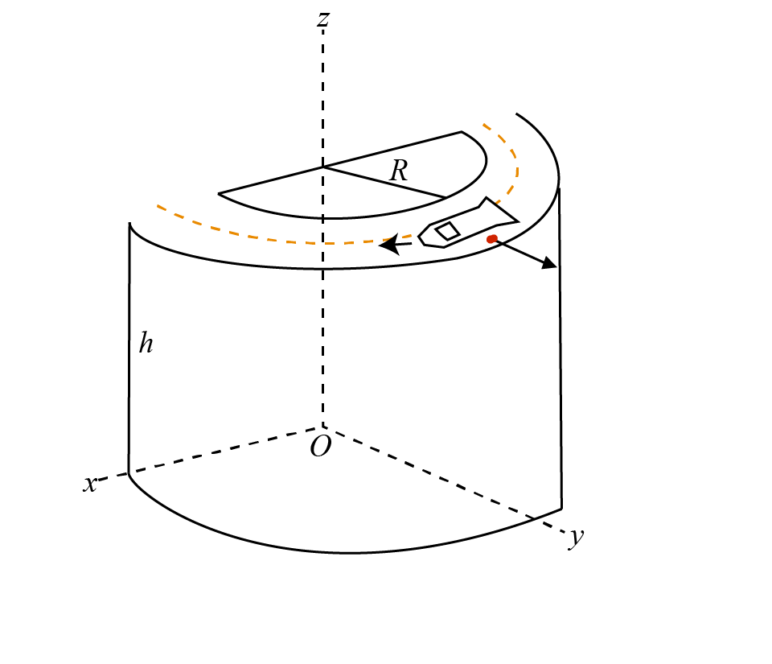

# {{ params.vars.title }}
A reckless driver speeds around a highway corner on the edge of a cliff, ${{params.z0}}ft$ above the ground, which has a radius of R = ${{params.y0}}ft$.
Their speed is constant at ${{params.vx0}}ft/s$.
As they pass the edge of the corner, they toss out an empty can, with a velocity of ${{params.vy0}}ft/s$ relative to the car.
Calculate the coordinates of the point of impact, neglect air resistance.

## Part 1

Calculate the X - coordinate of the landing point.

### Answer Section

## Part 2

Calculate the Y - coordinate of the landing point.

### Answer Section

## Part 3

Calculate the Z - coordinate of the landing point.

### Answer Section

## Attribution

Problem is licensed under the [CC-BY-NC-SA 4.0 license](https://creativecommons.org/licenses/by-nc-sa/4.0/).  