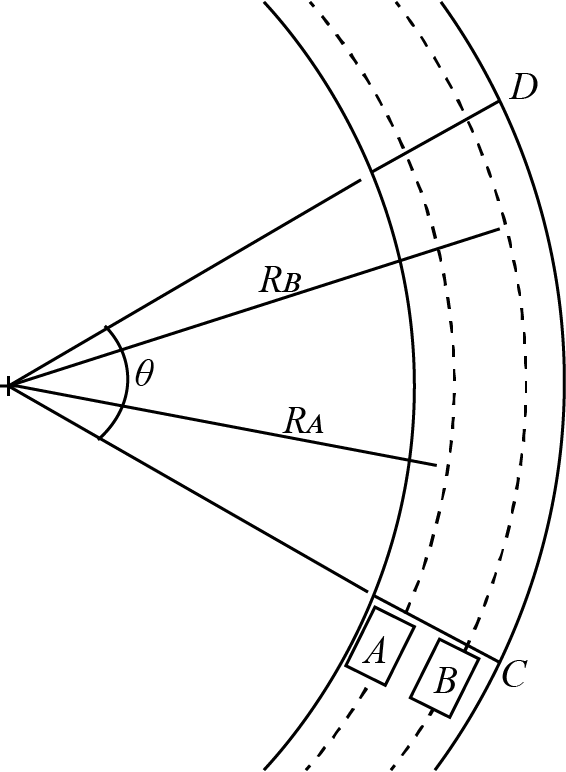

# {{ params.vars.title }}
Two cars travel at constant speeds around a curve as shown below.
The front end of both cars crosses line $C$ at the same time and each driver minimizes their time in the curve.
The maximum centripetal acceleration for car A is ${{params.max_acc_A}}g$ with $R\_{A} = {{params.ra}}$ $\rm{m}$ and for car B is ${{params.max_acc_B}}g$ with $R\_{B} = {{params.rb}}$ $\rm{m}$, where $g$ is the gravitational constant.
The angle $\theta = {{params.angle}}^{\circ}$.

## Question Text

Determine the distance $S$ that the second car has yet to travel to reach line $D$ when the first car reaches line $D$.

### Answer Section

Please enter in a numeric value in {{ params.vars.units }}.

## Attribution

Problem is licensed under the [CC-BY-NC-SA 4.0 license](https://creativecommons.org/licenses/by-nc-sa/4.0/).  