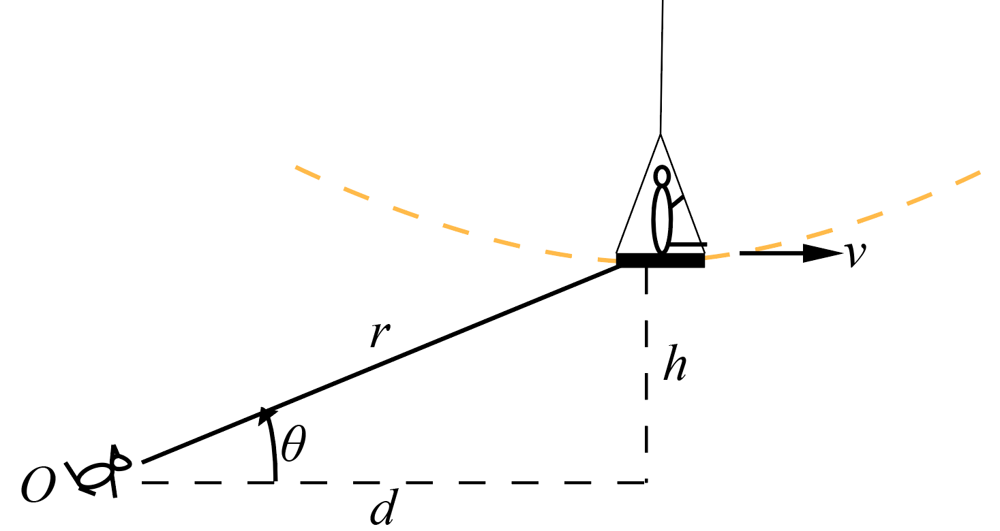

# {{ params_vars_title }}

As an child reaches the bottom of a loop of their swing in the vertical plane, they have a horizontal velocity of $v = {{params_v}}cm/s$ and no horizontal acceleration.
The radius of curvature for the loop is {{params_r2}}cm, and the height of the child off the ground is is ${{params_h}}cm$.
For their pet rabbit watching at $O$, $d = {{params_d}}cm$ away.

## Part 1

Determine the value of $\ddot{r}$.

### Answer Section

## Part 2

Determine the value of $\ddot{\theta}$.

### Answer Section

## Attribution

Problem is licensed under the [CC-BY-NC-SA 4.0 license](https://creativecommons.org/licenses/by-nc-sa/4.0/).  