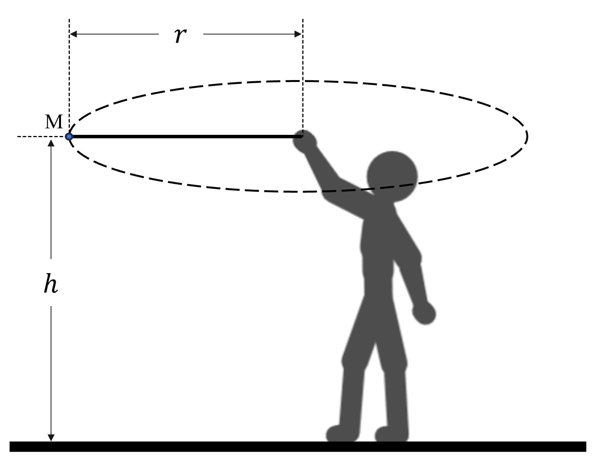

# {{ params_vars_title }}
A ball with a mass of $m = {{ params_m }} \ \rm{kg}$ is being swung above in a horizontal circle.
If the radius is $r = {{params_r}} \ \rm{m}$, the height is $h = {{params_h}} \ \rm{m}$, and the speed is $v_0 = {{params_v0}} \ \rm{m/s}$ once the string breaks:

## Part 1

Find the time required for the ball to hit the ground.

### Answer Section

Please enter in a numeric value in {{ params_vars_units }}.

## Part 2

Find the distance the ball travels till it hits the ground.

### Answer Section

Please enter in a numeric value in {{ params_vars_units }}

## Part 3

Fine the tension in the string before the string broke

### Answer Section

Please enter in a numeric value in {{ params_vars_units }}

## Attribution

Problem is licensed under the [CC-BY-NC-SA 4.0 license](https://creativecommons.org/licenses/by-nc-sa/4.0/).  