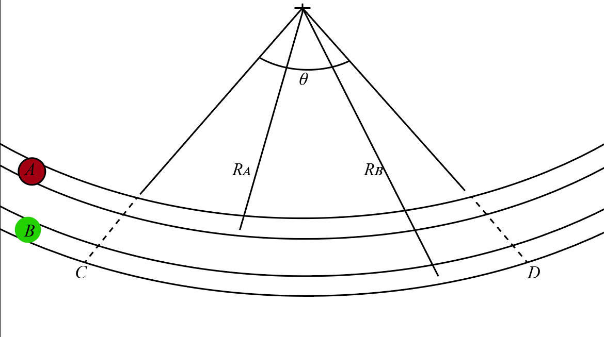

# {{ params.vars.title }}
Two marbles travel in track as part of a Rube Goldberg machine.
Both marbles cross line $C$ at the same time, and flow at a their maximum speed.
The maximum horizontal acceleration for marble A is ${{params.max_acc_A}}g$ with $R\_{A} = {{params.ra}} in$ and for marble B is ${{params.max_acc_B}}g$ with $R\_{B} = {{params.rb}} in$.
The angle $\theta = {{params.angle}}^{\circ}$.

## Question Text

Determine the distance $\gamma$ which the second marble has yet to go along its path to reach line $D$ when the first marble reaches it.

### Answer Section

Please enter in a numeric value in {{ params.vars.units }}.

## Attribution

Problem is licensed under the [CC-BY-NC-SA 4.0 license](https://creativecommons.org/licenses/by-nc-sa/4.0/).  