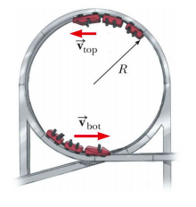

# {{ params.vars.title }}
A roller-coaster car moves around a vertical circular loop of radius $R$ = {{params.r}} m.
The total mass of the car (including passengers) is {{params.m}} kg.

## Part 1

What speed must the car have so that it will just make it over the top without any assistance from the track?

### Answer Section

Please enter in a numeric value in {{ params.vars.units }}.

## Part 2

What speed will the car subsequently have at the bottom of the loop?

### Answer Section

Please enter in a numeric value in {{ params.vars.units }}.

## Part 3

What will be the normal force on a passenger at the bottom of the loop?

### Answer Section

Please enter in a numeric value in {{ params.vars.units_2 }}.

## Attribution

Problem is licensed under the [CC-BY-NC-SA 4.0 license](https://creativecommons.org/licenses/by-nc-sa/4.0/).  