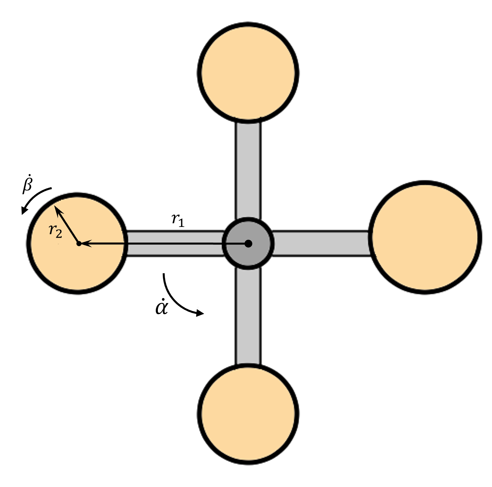

# {{ params_vars_title }}
The carnival ride illustrated below is spinning at $\dot \alpha = {{params.alpha_dot}} \ \rm{rev/s}$.
Each compartment's center is $r_1 = {{params_r1}} \ \rm{m}$ away from the center of the mechanism.
Passengers sit along the inner edge of the compartments, which have a radius $r_2 = {{params_r2}} \ \rm{m}$.
The compartments and the mechanism are spinning counterclockwise.

## Part 1

If a compartment is spinning at $\dot \beta = {{params.beta_dot}} \ \rm{rev/s}$ relative to the arm holding it, what is the maximum speed felt by a passenger during the ride?

### Answer Section

Please enter in a numeric value in m/s.

## Part 2

What is the lowest speed?

### Answer Section

Please enter in a numeric value in m/s.

## Attribution

Problem is licensed under the [CC-BY-NC-SA 4.0 license](https://creativecommons.org/licenses/by-nc-sa/4.0/).  