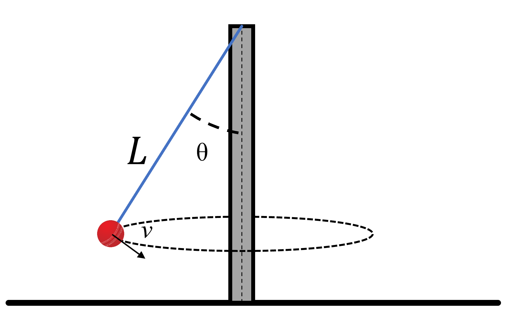

# {{ params.vars.title }}
Two friends are playing tetherball. The ball is tethered to a pole by a rope of length $L = {{params.L}} \ \rm{ft}$. The first player serves with a velocity $v = {{params.v}} \ \rm{m/s}$.

## Part 1

What angle $\theta$ does the rope make with the pole?

### Answer Section

Please enter in a numeric value in ${{ params.vars.units.part1 }}$.

## Part 2

At this speed, how many times per second would the ball go around the pole?

### Answer Section

Please enter in a numeric value in ${{ params.vars.units.part2 }}$.

## Attribution

Problem is licensed under the [CC-BY-NC-SA 4.0 license](https://creativecommons.org/licenses/by-nc-sa/4.0/).  