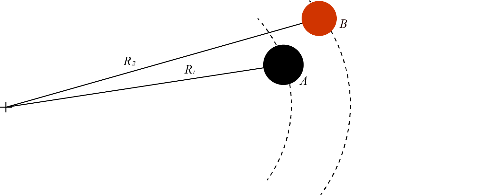

# {{ params.vars.title }}
A performer spins two yoyos at full length in a loop as part of a trick.
Yoyo A has a string length $R\_{1} = {{params.r1}}cm$ and yoyo B has a string length $R\_{2} = {{params.r2}}cm$.
What is the maximum speed of each yoyo if the strength of the string restricts centripetal acceleration to $g$ (Earth's gravitational constant)?

## Part 1

Determine the maximum speed for yoyo A.

### Answer Section

Please enter in a numeric value in {{ params.vars.units }}.

## Part 2

Determine the maximum speed for yoyo B.

### Answer Section

Please enter in a numeric value in {{ params.vars.units }}.

## Attribution

Problem is licensed under the [CC-BY-NC-SA 4.0 license](https://creativecommons.org/licenses/by-nc-sa/4.0/).  