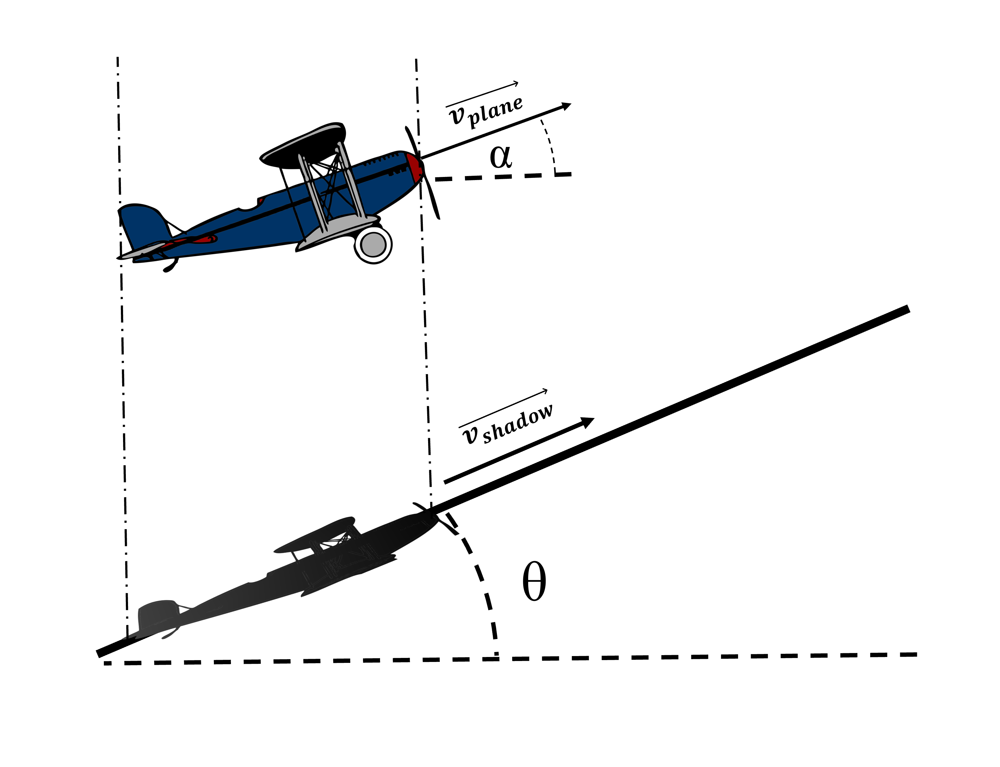

# {{ params_vars_title }}
As an airplane is taking off, it flies over a hill inclined ${{params_theta}}^{\circ}$ upwards.
The plane is inclined ${{params_alpha}}^{\circ}$ up from the horizon.

## Part 1

If the shadow moves at ${{params_Vshadow}} \ \rm{km/h}$ up the hill, what is the plane's speed?
The sun is directly above the plane.

### Answer Section

Please enter in a numeric value in km/h.

## Attribution

Problem is licensed under the [CC-BY-NC-SA 4.0 license](https://creativecommons.org/licenses/by-nc-sa/4.0/).  