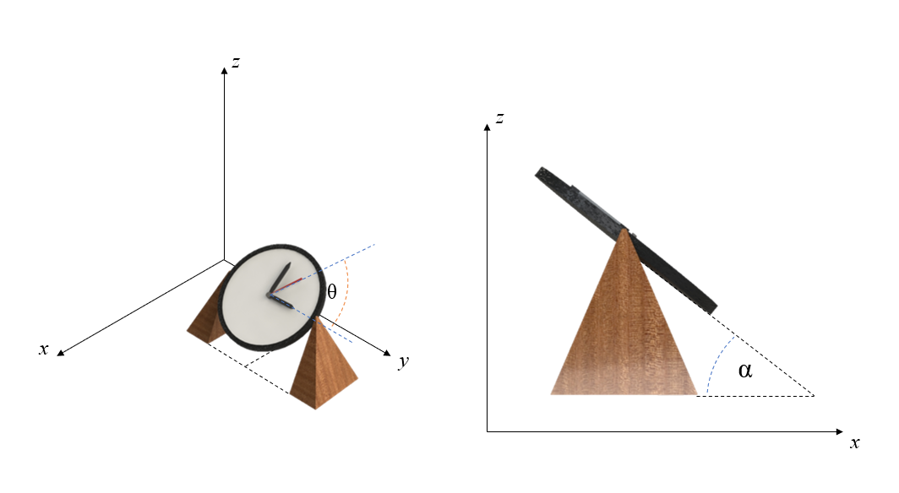

# {{ params_vars_title }}

It is well known that the second hand on a clock rotates at $1 \ \rm{RPM}$.
In the picture above, an analog clock sits slanted, making it easier for a person at a desk to read.
Take the radius of the second hand to be $R = {{ params_R }} \ \rm{m}$, $\alpha = {{ params_alpha }} ^{\circ}$, $\theta = {{ params_theta }} ^{\circ}$

## Part 1

What would the magnitude of velocity be for the end of the seconds hand?

### Answer Section

Please enter in a numeric value in {{ params_vars_units }}.

## Part 2

What would the x-component of velocity be?

### Answer Section

Please enter in a numeric value in {{ params_vars_units }}.

## Part 3

What would the y-component of velocity be?

### Answer Section

Please enter in a numeric value in {{ params_vars_units }}.

## Part 4

What would the z-component of velocity be?

### Answer Section

Please enter in a numeric value in {{ params_vars_units }}.

## Attribution

Problem is licensed under the [CC-BY-NC-SA 4.0 license](https://creativecommons.org/licenses/by-nc-sa/4.0/).  