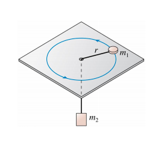

# {{ params.vars.title }}

## Question Text

Mass $m_1$ on the $horizontal$ frictionless table of the figure is connected by a string through a hole in the table to a hanging mass $m_2$. With what angular speed $\omega$ must $m_1$ rotate in a circle of radius $r$ if $m_2$ is to remain hanging at rest? Find an expression for $\omega$ in terms of $m_1$, $m_2$, $r$, and $g$.

Note that it may not be necessary to use every variable. Use the following table as a reference for each variable:

| $Variable$ | Use   |
|----------|-------|
| $m_1$  | m_1  |
| $m_2$  | m_2  |
| $g$  | g  |
| $r$  | r  |

### Answer Section

## Attribution

Problem is licensed under the [CC-BY-NC-SA 4.0 license](https://creativecommons.org/licenses/by-nc-sa/4.0/).  