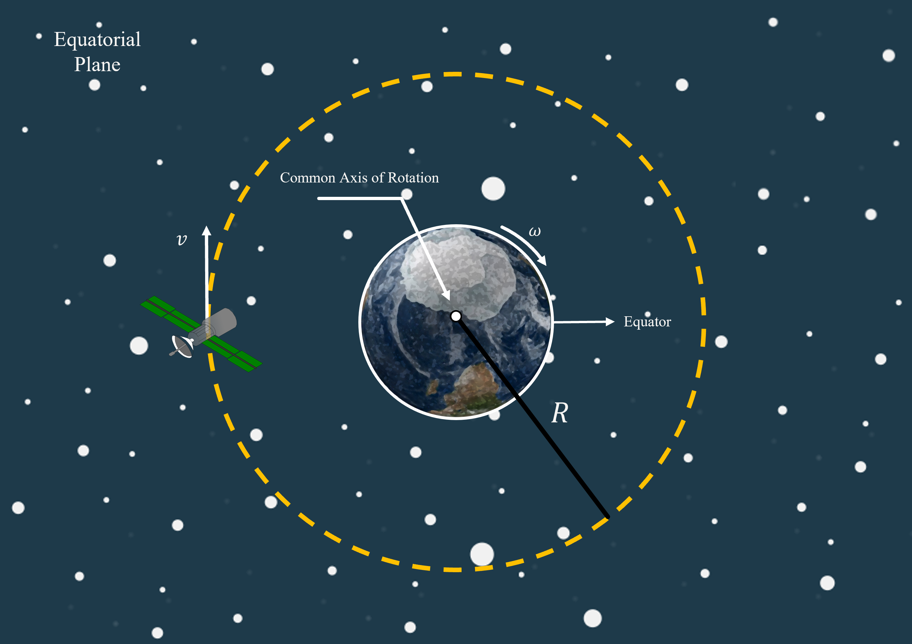

# Geostationary Orbits
A communications satellite is orbiting the Earth with constant speed $v\ \rm{km/h}$.

## Part 1

If there are no other forces acting on the satellite except for the mutual gravitational force acting between the satellite and the Earth, calculate the effective radius ($R$) of the orbit of the satellite.   Treat the earth and satellite as particles.

$v = {{ params_v }}\ \rm{km/h}$, $M\_{earth} = 5.976\times 10^{24}\ \rm{kg}$, $M\_{satellite} = {{ params_m }}\ \rm{kg}$

### Answer Section

Please enter in a numeric value in m.

## Part 2

For rapid communication between satellites in orbit and receivers on the ground, these communication satellites are stationed in 'geostationary' orbits around the Earth, with both the Earth and satellite sharing the same plane and axis of rotation.

By showing that the period of revolution of the satellite satisfies the following relationship,
 
$T= ({\frac{4\pi^{2}R^{3}}{GM\_{Earth}}})^{\frac{1}{3}}$
 
 
Calculate the height, $h$ above the surface of the earth for the satellite to be in a 'geostationary' orbit.
 
$R\_{Earth} = 6371\ \rm{km}$

### Answer Section

Please enter in a numeric value in m.

## Attribution

Problem is licensed under the [CC-BY-NC-SA 4.0 license](https://creativecommons.org/licenses/by-nc-sa/4.0/).  